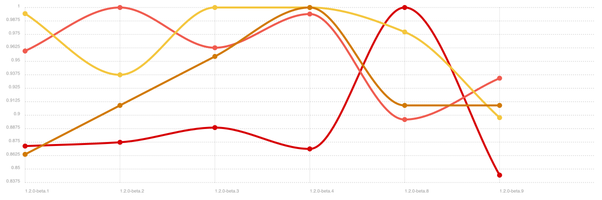

<div align="center">
  <a href="https://github.com/bkniffler/debe">
    
  </a>
</div>
<div align="center">
  <strong>Flexible and reactive offline-first Javascript datastore for browsers, node, electron and react-native with focus on performance and simplicity. Includes support for concurrent multi-master/client database replication via plugin.</strong>
    <br />
    <br />
  <i><small>Debe is currently under development, feel free to participate via PR or issues. Consider debe to not be production ready yet. Core API is considered pretty final, though plugin API like replication might change a bit.</small></i>
  <br />
  <br />
  <a href="https://travis-ci.org/bkniffler/debe">
    
  </a>
  <a href="https://codecov.io/github/bkniffler/debe">
    
  </a>
  <a href="https://github.com/bkniffler/debe">
    
  </a>
  <a href="https://github.com/bkniffler/debe">
    
  </a>
  <a href="https://github.com/bkniffler/debe/master/LICENSE">
    
  </a>
  <a href="https://github.com/bkniffler/debe">
    
  </a>
  <a href="https://github.com/bkniffler/debe">
    
  </a>
  <br />
  <br />
</div>

# Content

- [Intro](#intro)
- [Features](#features)
- [Why](#why)
- [Guides](#guides)
  - [Basic](#basic)
  - [Replication](#replication)
  - [Querying](#querying)
  - [Use](#use)
- [Bindings](#bindings)
  - [Vanilla](#vanilla)
  - [TypeScript](#typescript)
  - [React/React native hooks](#react)
- [Adapter](#adapters)
  - [Memory](#memory)
  - [Socket](#socket)
  - [Better-SQLite3](#better-sqlite3)
  - [PostgreSQL](#postgresql)
- [Development](#development)
  - [Roadmap](#roadmap)
  - [Continuous Benchmarking](#continuous-benchmarking)
- [Credits](#credits)
  - [Dependencies](#dependencies)
  - [Similar](#similar)
  - [Assets](#assets)

# Intro

## Features

- Simple API
- Lightweight
- Native Typescript
- Rich querying using SQL-alike syntax
- Schemaless, thus no migrations needed
- Query listening/subscription
- Offline first
- Soft deletion
- Support for any JS environment (electron, react-native, nodeJS, browser)
- React bindings
- Great performance with large datasets
- Access to native database features (raw SQL queries, custom indices)
- Realtime sync
- Multi-master replication
- Replication-Filters
- Server-side authentication/authorization
- Automatic conflict resolution (CRDT)
- Undo/Redo capabilities
- Easy scaling with Kubernetes
- Continuos testing and benchmarking

## Why

PouchDB/RxDB are great and very mature solutions for replicating databases, but being forced to build your services on top of CouchDB can be unfitting for some users. Debe is a fast and modern solution if you want to replicate and fetch your data in every way imaginable, so master-to-clients, master-to-masters-to-clients or master-to-client-to-master-to-client. There are multiple adapters available and implementing new ones is super simple due to the simple API surface. For a starting point, you can always take a look at memory-adapter. Also, there is a headless socket client adapter that connects to any remote debe instance to perform queries. This works great for electronJS where you might want to pipe all requests to another thread that performs the actual data access or for always-online web applications that would neither persist nor replicate locally.

Debes SQL adapters store the data body as JSON type and make use of the neat JSON indexing features SQLite and PostgreSQL provide, so you get great performance without sacrificing flexibility of your schema or direct queryability (which makes native full-text search indexing easy). There is no need for external index tables.

Authorization and authentication are also difficult to implement with other database solutions, at least if you want to have full control of these features through nodeJS. Debe, and having the whole data flow in Javascript, offers some cool possibilities to control data access and filter & transform incoming/outgoing data according to user permissions. This works through middlewares.

Please note, Debe is currently not supporting relations, and probably never really will. If you're interested in relational data and graphs, you might be better off with graphQL, apollo and AppSync. Debe is focused on offline-first, performance, simplicity and being super slim.

# Guides

## Basic

https://codesandbox.io/s/5wn340ovn

```js
const { Debe } = require('debe');
const { MemoryAdapter } = require('debe-memory');

const schema = [{ name: 'lorem', index: ['name'] }];

async function work() {
  console.log('Start');
  const db = new Debe(new MemoryAdapter(), schema);
  await db.initialize();
  console.log('Initialized');
  await generateItems(db, 10000);
  const items = await db.all('lorem', {
    where: ['name < ?', 'a10']
  });
  console.log(`Fetched ${items.length} items`);
}

async function generateItems(db, numberOfItems) {
  const start = new Date().getTime();
  const items = [];
  for (let x = 0; x < numberOfItems; x++) {
    items.push({ name: 'a' + (x < 10 ? `0${x}` : x) });
  }
  await db.insert('lorem', items);
  console.log(
    `Generated ${numberOfItems} in ${new Date().getTime() - start}ms`
  );
}

work().catch(err => console.log(err));
```

## Replication

https://codesandbox.io/s/y27xmr9rvj

```js
const { Debe } = require('debe');
const { MemoryAdapter } = require('debe-memory');
const { Sync } = require('debe-sync');
const { SyncServer } = require('debe-sync-server');

const schema = [{ name: 'lorem', index: ['name'] }];

async function work() {
  const port = 5555;
  console.log('Start');
  // Master
  const server = await spawnServer(port);
  const client = await spawnClient(port);
  // Init
  console.log('Initialized');
  // Step1
  await generateItems(server.db, 10000);
  await generateItems(client.db, 1000);
  // Step2
  await wait(1000);
  console.log(`db0 ${await server.db.count('lorem')} items`);
  console.log(`db1 ${await client.db.count('lorem')} items`);
  console.log(
    `Was synced? ${(await client.db.count('lorem')) ===
      (await server.db.count('lorem'))}`
  );
  await server.close();
  await client.close();
}

async function spawnServer(port) {
  const db = new Debe(new MemoryAdapter(), schema);
  const server = new SyncServer(db, port);
  await server.initialize();
  return server;
}

async function spawnClient(port) {
  const db = new Debe(new MemoryAdapter(), schema);
  const sync = new Sync(db, ['localhost', port]);
  await db.initialize();
  return sync;
}

async function generateItems(db, numberOfItems) {
  const start = new Date().getTime();
  const items = [];
  for (let x = 0; x < numberOfItems; x++) {
    items.push({ name: 'a' + (x < 10 ? `0${x}` : x) });
  }

  await db.insert('lorem', items);
  console.log(
    `Generated ${numberOfItems} in ${new Date().getTime() - start}ms`
  );
}

async function wait(ms) {
  await new Promise(yay => setTimeout(yay, ms));
}

work().catch(err => console.log(err));
```

## Querying

Querying is simple and similar to SQL. You can subscribe to query changes by providing a callback.

```tsx
// Javascript
const value = await db1.all('lorem', {
  where: ['name < ? AND lastChanged > ?', 'a50', +new Date()],
  orderBy: ['name', 'rev DESC']
});

// With Subscription
const unsubscribe = db1.all(
  'lorem',
  {
    where: ['name < ? AND lastChanged > ?', 'a50', +new Date()],
    orderBy: ['name', 'rev DESC']
  },
  value => console.log(value)
);

// Typescript
db1.all<ILorem>('lorem', {
  where: ['name < ? AND lastChanged > ?', 'a50', +new Date()],
  orderBy: ['name', 'rev DESC']
});
```

## Use

With `use`, you can create a collection-scoped instance of debe.

```tsx
// General
await db.insert('lorem', { name: 'Lorem' });
// Scoped
const lorem = db.use('lorem');
await lorem.insert({ name: 'Lorem' });
```

# Bindings

## Vanilla

```js
import { Debe } from 'debe';
import { MemoryAdapter } from 'debe-memory';

const collections = [{ name: 'lorem', index: ['name'] }];
const db = new Debe(new MemoryAdapter(), collections);

(async function() {
  await db.initialize();
  await db.insert('lorem', { name: 'Lorem' });
  db.all('lorem', {
    where: ['name = ?', 'Lorem'],
    orderBy: ['name']
  });
})();
```

## TypeScript

```tsx
import { Debe } from 'debe';
import { MemoryAdapter } from 'debe-memory';

interface ILorem {
  name: string;
}

const collections = [{ name: 'lorem', index: ['name'] }];
const db = new Debe(new MemoryAdapter(), collections);

(async function() {
  await db.initialize();
  const lorem = db.use<ILorem>('lorem');
  await lorem.insert({ name: 'Lorem' });
  lorem.all({
    where: ['name = ?', 'Lorem'],
    orderBy: ['name']
  });
})();
```

## React

```jsx
import { Debe } from 'debe';
import { MemoryAdapter } from 'debe-memory';
import { DebeProvider, useAll } from 'debe-react';

function MyComponent(props) {
  const [result] = useAll('lorem', {
    where: ['name = ?', 'Lorem']
  });
  return (
    <ul>
      {result.map(item => (
        <li key={item.id}>
          <span>{item.name}</span>
        </li>
      ))}
    </ul>
  );
}

const collections = [{ name: 'lorem', index: ['name'] }];
render(
  <DebeProvider
    initialize={async db => {
      await db.insert('lorem', [{ name: 'Lorem' }]);
    }}
    value={() => new Debe(new MemoryAdapter(), collections)}
    render={() => <Component />}
    loading={() => <span>Loading...</span>}
  />
);
```

# Adapters

## Memory

Universal inmemory adapter for no persistence

**Targets**

- All targets

## Socket

Universal Socket client that connects to a socket-server debe instance remotely

**Targets**

- All targets

## SQL

### SQLite

NodeJS, react-native, electron adapter that uses SQLite

**Targets**

- NodeJS
- Electron main
- React-Native

### PostgreSQL

NodeJS, electron adapter for PostgreSQL

**Targets**

- NodeJS
- Electron main

### IndexedDB

IndexedDB adapter based on idb.

**Targets**

- Browser
- Electron renderer

# Development

## Contributing

All contributions are welcome. Feel free to PR!

## Roadmap

All contributions welcome :)

- Docs
  - [ ] Write real docs :(
  - [ ] Kubernetes & scaling docs
- Replication
  - [ ] Progress
  - [x] Chunking
  - [x] Batching
  - [x] Conflict Resolution (automerge?)
  - [ ] Improve replication tests
- Socket
  - [ ] Autodiscovery (bonjour, UDP broadcast)
- [x] Subscription
  - [x] Batching
- Adapters
  - [x] Memory
  - [x] Socket
  - [x] PostgreSQL
  - [x] SQLite
  - [x] IndexedDB
  - [ ] MongoDB
  - [ ] AWS DynamoDB
  - [ ] MS CosmosDB
  - [ ] CouchDB/Cloudant
  - [ ] RocksDB
  - [ ] Redis
- Bindings
  - [x] React
  - [ ] Vue
- Comparison
  - [ ] Comparison chart with other libraries (find non-biased features)
  - [ ] Performance comparison
- Testing
  - [ ] Improve testing
  - [ ] Performance testing

## Continuous Benchmarking

This is some [basic benchmarks](./benchmark/index.ts), just to keep track of performance hits during internal changes. Minimal impacts up/down are always expected due to benchmarking inaccuracy.



# Credits

## Dependencies

- [nanoid](https://github.com/ai/nanoid)
- [asyngular](https://asyngular.io)
- [automerge](https://github.com/automerge/automerge)

## References

- http://citeseerx.ist.psu.edu/viewdoc/download?doi=10.1.1.68.8635&rep=rep1&type=pdf

## Similar

- PouchDB
- RxDB
- Realm
- GunJS
- NanoSQL
- Google Firebase

## Assets

- Vector Graphic: [www.freepik.com](https://www.freepik.com/free-photos-vectors/background)
